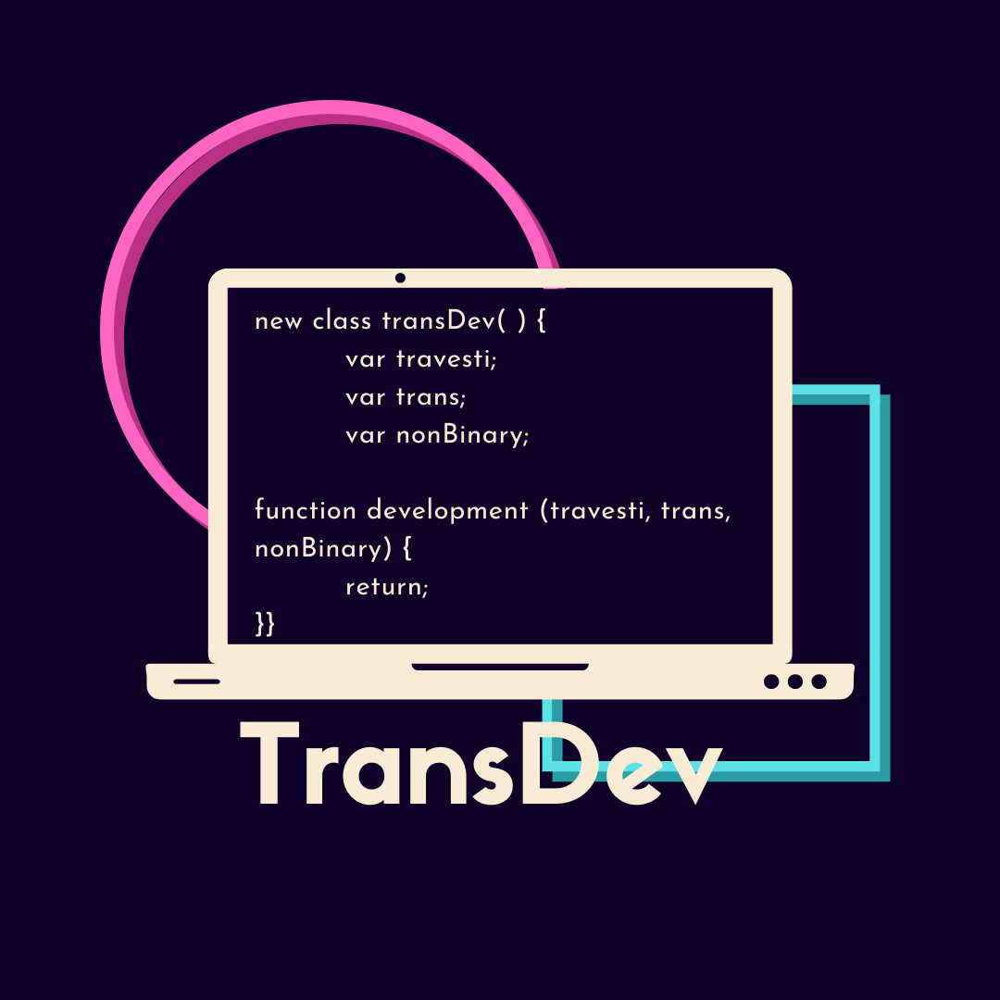

<h1>

 
TransDev for VSCode
</h1>

## Tudo certo jovem?

## Este é o tema oficial da TransDev para o VSCode.

Criado com muito amor e paciência viu porque não foi fácil não visse.
 
Então instale logo aí pra dar uma força pra nós ^^.

 

# Sobre a autora:

         
        
Diana Martine

    Programadora e desenvolvedora Front-end certificada pelo programa de capacitação TRANS.FORMA ofertado pelo Porto Digital. Estudante de Psicologia (UNISÃOMIGUEL) e Análise e Desenvolvimento de Sistemas (UNINABUCO). Musicista profissional, violonista, multi-instrumentista.
 
 

# Contribua

Caso esse repositório tenha te ajudado com seus estudos de alguma forma:

- 🤝 Fork este repositório para estudo e contribua com o conhecimento.
- ⭐ deixe sua estrela neste repositório.
